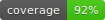

# Downloads Sorter



Python application sorting the Downloads folder by searching for file name patterns. These include GIBZ-Module names like "M320", "M319" and other patterns like "EN" or "FR".

## What it does

- Automatically detects standalone `MXXX` module codes like `M122`, `M164`, or `M431` from file and folder names.
- Also finds files and folders that start with `DE`, `GR`, `FR`, or `PH` followed by a space, `_`, `-`, `.`, or the end of the filename.
- Scans the desktop for folders containing the same pattern.
- Moves matching files from Downloads into the matching desktop folder.
- Creates the desktop folder when no matching folder exists.
- Deletes `.zip` files from Downloads when an extracted folder already exists there.
- Moves image files without an `MXXX` pattern into the Windows Pictures/Bilder folder.
- Moves `.mp4` files without an `MXXX` pattern into the Windows Videos folder.
- Sends a detailed summary email with Resend after each cleaning run.

## Install

```powershell
pip install -r .\requirements.txt
```

The app also tries to install this dependency automatically when `Start Cleaning` is selected and the package is missing.

## Run

```powershell
python .\download_sorter.py
```

The first run creates `sorter_config.json` next to the script. Use the `Config` menu to change paths or exclusions.

## Config Options

- Exclude specific paths or files.
- Exclude files that are newer than a chosen number of days.
- Exclude one or more `MXXX`, `DE`, `GR`, `FR`, or `PH` patterns.
- Change the Downloads, Desktop, Bilder, or Videos paths.
- Configure the email sent at the end.

By default, the program asks Windows for the real known-folder paths, so it should work with different usernames and with redirected OneDrive folders.

## Email Summary

The cleaner will not start until a Resend API key is available. Add it in the `Config` menu or set it as the local environment variable `RESEND_API_KEY`.

The local `sorter_config.json` file is ignored by Git so your API key, email address, and personal paths are not committed.

## Email Template

Edit `email_template.md` to customize the structure of the summary email. The app replaces placeholders like `{{finished_at}}`, `{{image_moves}}`, and `{{video_moves}}` before sending.
